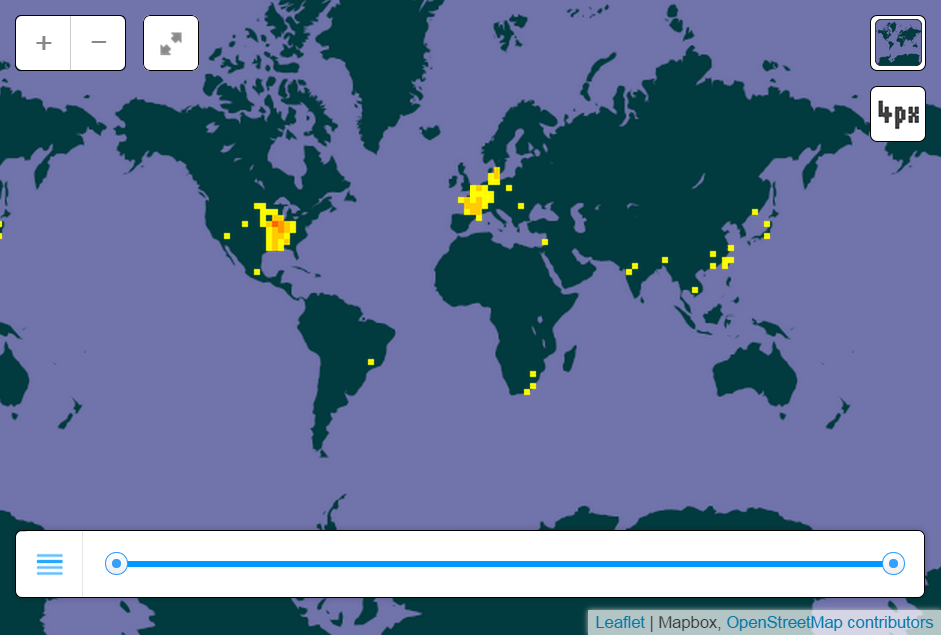

## ESM 296-4f Project Proposal

## Group Members

Daniel Hannigan
Christopher Uraine

## Species

Hypophthalmichthys molitrix (a.k.a. Asian Carp)

## Description

"The silver carp (Hypophthalmichthys molitrix) is a species of freshwater cyprinid fish, a variety of Asian carp native to north and northeast Asia. It is cultivated in China. Pound for pound, more silver carp are produced worldwide in aquaculture than any other species. They are usually farmed in polyculture with other Asian carp, or sometimes Indian carp or other species. It has been introduced to, or spread by connected waterways, into at least 88 countries around the world. The most common reason for importation was for use in aquaculture, but enhancement of wild fisheries and water quality control were also important reasons for importation." (Kolar et al. 2005.)

## Species Extent

