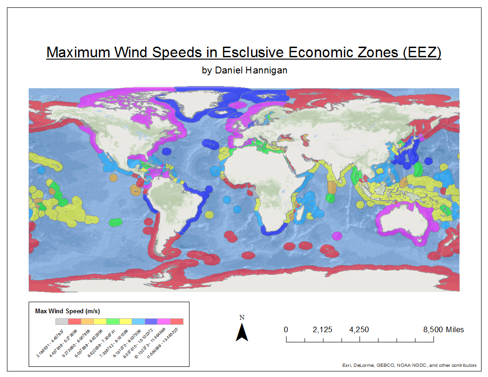

## ESM 296-4f: Lab 2

## Maximum Wind Speeds in Exclusive Economic Zones (EEZ)

## Top 3 Countries (Max)

1.) Heard and McDonald Islands

2.) Kerguelen Islands

3.) Crozet Islands

## Top 3 Countries (Mean)

1.) Crozet Islands

2.) Macquarie Island

3.) Kerguelen Islands

## Final Model

