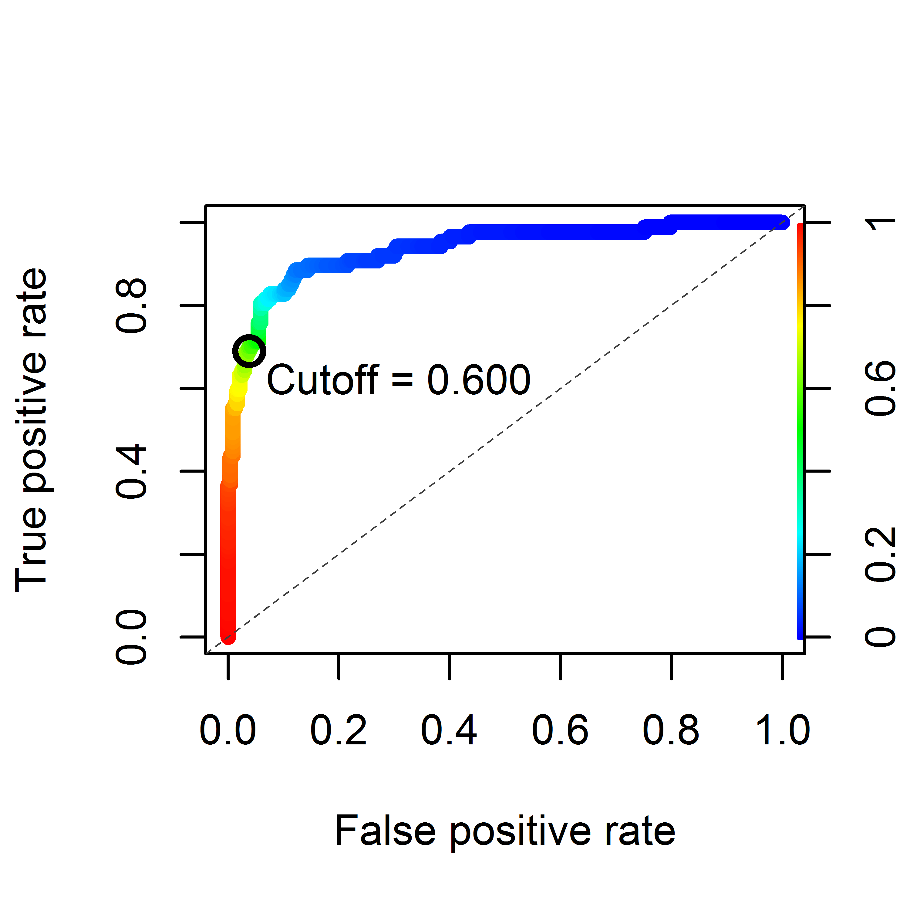
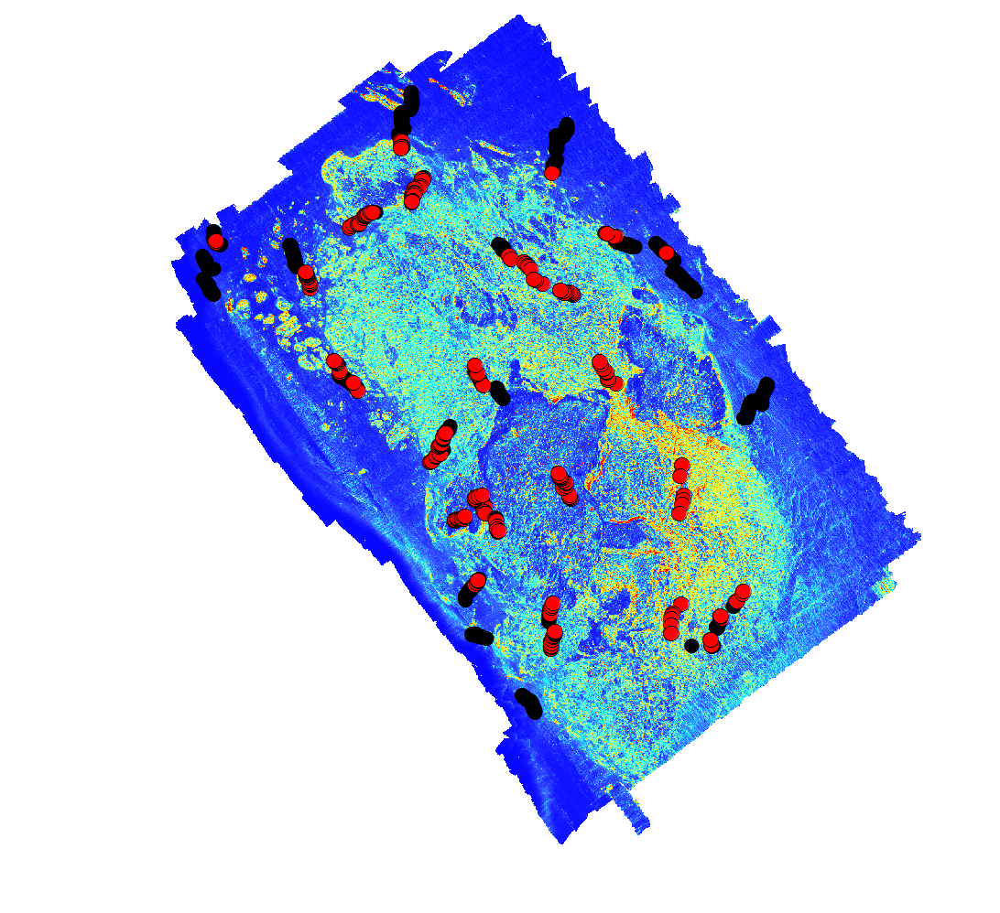

# Lab 4: Species Distribution Modeling Lab 

## Diagnostic Plot

##Summary Statistics

Call:
glm(formula = presence ~ log(Slope) + log(VRM) + Depth, family = binomial(link="logit"), data = na.omit(d))

Deviance Residuals: 
    Min       1Q   Median       3Q      Max  
-2.4227  -0.3165  -0.1625  -0.0637   3.5639  

Coefficients:
            Estimate Std. Error z value Pr(>|z|)    
(Intercept) 7.898102   1.144141   6.903 5.09e-12 
log(Slope)  1.116601   0.239532   4.662 3.14e-06
log(VRM)    0.420629   0.127982   3.287  0.00101 
Depth       0.061859   0.007929   7.802 6.10e-15 
---
Signif. codes:  0 '***' 0.001 '**' 0.01 '*' 0.05 '.' 0.1 ' ' 1

(Dispersion parameter for binomial family taken to be 1)

    Null deviance: 699.33  on 648  degrees of freedom
Residual deviance: 292.12  on 645  degrees of freedom
AIC: 300.12

Number of Fisher Scoring iterations: 6

Analysis of Deviance Table

Model: binomial, link: logit

Response: presence

Terms added sequentially (first to last)

           Df Deviance Resid. Df Resid. Dev  Pr(>Chi)    
NULL                         648     699.33              
log(Slope)  1   120.22       647     579.10 < 2.2e-16 
log(VRM)    1   182.42       646     396.68 < 2.2e-16 
Depth       1   104.55       645     292.12 < 2.2e-16 
---
Signif. codes:  0 '***' 0.001 '**' 0.01 '*' 0.05 '.' 0.1 ' ' 1

Deviance explained = 58.2%

Variance Inflation Factors:

                VIF
log(Slope) 1.911305
log(VRM)   1.852919
Depth      1.341887

##Final Map of Predicted Rockfish Locations

